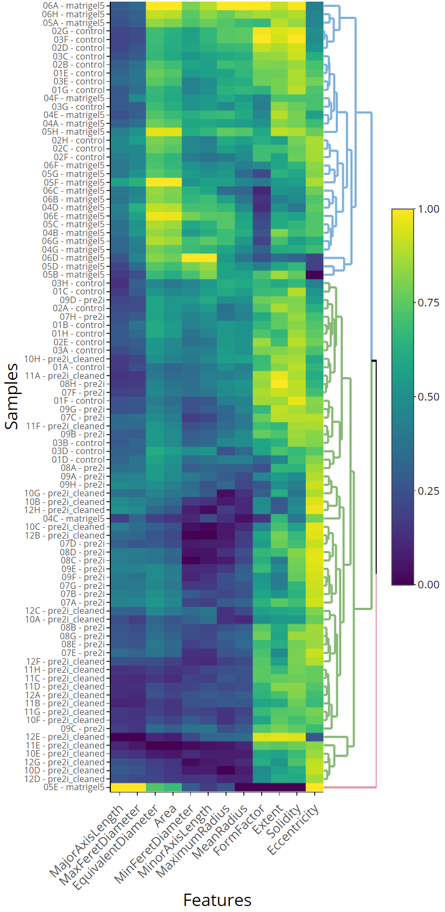

[](https://mybinder.org/v2/gh/hmbotelho/SPAOM2020-ws1-high-content-screening/master)


# SPAOM 2020

# Workshop 1: High-Content Screening
## High content image analysis with CellProfiler
24 November 2020

[Hugo M. Botelho](http://webpages.fc.ul.pt/~hmbotelho), Biosystems and Integrative Sciences Institute, University of Lisboa  
<hmbotelho@fc.ul.pt>  


We will use CellProfiler as a tool to batch analyze a 2D and a 3D imaging dataset. We will introduce the recently released CellProfiler 4 and present the major changes in this version. Then, we will design a custom analysis pipeline to segment objects, extract quantitative features and export a results table. We will also show how the analysis pipeline can be customized to address advanced analytical requirements and allow annotation with experimental metadata.


## Table of Contents

* [1. **CellProfiler**](#cellprofiler)
    * [1.1. What is CellProfiler](#cellprofiler_whatis)
    * [1.2. What's new in CellProfiler 4?](#cellprofiler_whatsnew)
* [2. **2D image analysis**](#analysis2D)
    * [2.1. Goal](#analysis2D_goal)
    * [2.2. Dataset description](#analysis2D_dataset)
    * [2.3. Image analysis](#analysis2D_imageanalysis)
    * [2.4. Data analysis](#analysis2D_dataanalysis)
* [3. **3D image analysis**](#analysis3D)
    * [3.1. Goal](#analysis3D_goal)
    * [3.2. Dataset description](#analysis3D_dataset)
    * [3.3. Image analysis](#analysis3D_imageanalysis)
    * [3.4. Data analysis](#analysis3D_dataanalysis)

## <a name="CellProfiler">1. CellProfiler</a>


### <a name="cellprofiler_whatis">1.1. What is CellProfiler</a>

CellProfiler is free, open-source, public domain software designed to enable biologists without training in computer vision or programming to quantitatively measure phenotypes from thousands of images automatically (batch processing). Runs on Windows and macOS.

Advanced algorithms for image analysis are available as individual modules that can be placed in sequential order together to form a pipeline. The pipeline is then used to identify and measure biological objects and features in images, particularly those obtained through fluorescence microscopy.

The basic functionality of CellProfiler can be extended with custom modules (Python).

- **Goal:** Provide powerful image analysis methods with a user-friendly interface.
- **Application:** Batch analysis of object-based features.
- **Philosophy:** Measure everything, ask questions later.
- **Data analysis:** Based on individual cells (high content).

[Download CellProfiler here](https://cellprofiler.org/releases)


### <a name="cellprofiler_whatsnew">1.2. What's new in CellProfiler 4?</a>

- Migrates CellProfiler from Python 2 to Python 3.  
- Improved compatibility with older pipelines (v2, v3).  
- Bug fixes (⚠ *outputs may vary from previous versions*).  
- Morphometry now uses scikit-image (⚠ *outputs may vary from previous versions*).  
- UI improvements.  
- Improved contrast display options.  
- Improved 3D viewer.  
- Performance improvements.  
- Measure colocalization in 16-bit images.  
- Improved customization and automation in MeasureTexture, MeasureGranularity and MeasureImageIntensity.  
- Removed LoadImages and LoadSingleImages.  
- ...


[Read full blog post here](https://carpenterlab.broadinstitute.org/blog/cellprofiler-40-release-improvements-speed-utility-and-usability)


**Current version:** 4.0.6

## <a name="analysis2D">2. 2D image analysis</a>


### <a name="analysis2D_goal">2.1. Goal</a>
Extract features for image classification.


### <a name="analysis2D_description">2.2. Dataset description</a>

2D images for single gastruloids expressing a GFP-fused gene. Imaged with a PerkinElmer Opera Phenix system. 

- **Number of images:** 96
- **Pixel size:** 270 × 270 pixels
- **Number of channels:** 2 (brightfield + GFP)
- **Dataset size:** 13.6 MB
- **Experimental treatments:** see `metadata.csv` or the table below

|             Images                	|   Treatment   	|
|:----------------------------------:	|:-------------:	|
| 01A - 01H ; 02A - 02H ; 03A - 03H 	|    control    	|
| 04A - 04H ; 05A - 05H ; 06A - 06H 	|   matrigel5   	|
| 07A - 07H ; 08A - 08H ; 09A - 09H 	|     pre2i         |
| 10A - 10H ; 11A - 11H ; 12A - 12H 	|  pre2i_cleaned 	|

**Sample images**


### <a name="analysis2D_imageanalysis">2.3. Image analysis</a>

We will implement a CellProfiler 4 analysis pipeline to extract object features which may be used to implement an image classifier.

Two CellProfiler pipelines files are available:
* `2Danalysis_simple.cppipe` Basic analysis [download](./dataset2D/2Danalysis_simple.cppipe)
* `2Danalysis_full.cppipe` Complete analysis, with additional steps [download](./dataset2D/2Danalysis_full.cppipe)

Analysis of the dataset with `2Danalysis_full.cppipe` will produce the data stored in the [outputs folder](./dataset2D/output).


The **simple pipeline** implements the following steps:

1. Annotate dataset with experimental treatments provided in `metadata.csv`;  
2. Split channels;  
3. Preprocess brightfield image for gastruloid segmentation;  
4. Gastruloid segmentation;  
5. Measure GFP fluorescence intensity at each gastruloid;  
6. Export features and metadata.  


The **full pipeline** implements the following steps:

1. Annotate dataset with experimental treatments provided in `metadata.csv`;  
2. Split channels;  
3. Preprocess brightfield image for gastruloid segmentation;  
4. Gastruloid segmentation;  
5. **Exclude images without gastruloids;**  
6. **Background correction in the GFP channel;**  
7. Measure GFP fluorescence intensity at each gastruloid;  
8. **Measure object morphometric features;**  
9. **Save segmentation results as images;**  
10. Export features and metadata.  

Within the CellProfiler pipeline each module contains notes explaining what it is performing on this analysis.  

Examples from gastruloid segmentation with these pipelines:  


### <a name="analysis2D_dataalysis">2.4. Data analysis</a>

One can process the numerical features to build an image classifier. This is illustrated below with an R script which performs hierarchical clustering (unsupervised machine learning).


```R
# Short R script
library(ggplot2)
library(heatmaply)
library(dplyr)

# Load CellProfiler data
cpdata <- read.csv("./dataset2D/output/objects.csv")

# Select relevant data
okcols <- c("AreaShape_Area", "AreaShape_Eccentricity", "AreaShape_EquivalentDiameter", "AreaShape_Extent", 
            "AreaShape_FormFactor", "AreaShape_MajorAxisLength", "AreaShape_MaxFeretDiameter", 
            "AreaShape_MaximumRadius", "AreaShape_MeanRadius", "AreaShape_MinFeretDiameter", 
            "AreaShape_MinorAxisLength", "AreaShape_Solidity")
cpdata_relevant <- cpdata[,okcols]
colnames(cpdata_relevant) <- sub("AreaShape_", "", colnames(cpdata_relevant))
rownames(cpdata_relevant) <- paste0(cpdata$Metadata_colrow, " - ", cpdata$Metadata_treatment)

# Scale data
for(i in 1:ncol(cpdata_relevant)){
    x_data <- cpdata_relevant[[i]]
    x_min  <- min(x_data, na.rm = T)
    x_max  <- max(x_data, na.rm = T)
    cpdata_relevant[[i]] <- (x_data-x_min)/(x_max-x_min)
}

# Heatmap
fig <- heatmaply(cpdata_relevant,
          xlab = "Features",
          ylab = "Samples",
          margins = c(100, 140, 40, 0),
          show_dendrogram = c(TRUE, FALSE),
          fontsize_row = 7,
          k_row = 3)

fig %>% layout(autosize = F, width = 500, height = 1000)
```





One can identify three major clusters:  

- **Cluster 1:** mostly control + matrigel samples
- **Cluster 2:** mostly pre2i and pre2i_cleaned
- **Cluster 3:** outlier

## <a name="analysis3D">3. 3D image analysis</a>


### <a name="analysis3D_goal">3.1. Goal</a>
Quantify GFP fluorescence in different cell populations (3D).


### <a name="analysis3D_dataset">3.2. Dataset description</a>

One gastruloid imaged with light sheet fluorescence microscopy after fixation and staining to measure the expression level of a certain marker gene.


**C01 (Red):** nuclei  
**C02 (Green):** GFP-tagged protein  

To compare cell populations with different GFP expression levels 4 substacks were extracted from the original volume:

| Stack  | pixel size      |
|:-----: |:---------------:|
|   1    |  57 × 57 × 30   |
|   2    |  57 × 57 × 137  |
|   3    |  57 × 57 × 64   |
|   4    |  57 × 57 × 66   |

- **Number of stacks:** 4
- **Number of channels:** 2 (DNA + GFP)
- **Number of images:** 8
- **Dataset size:** 6.5 MB
- **Relative voxel dimensions (x, y, z):** (0.76, 0.76, 2)


### <a name="analysis3D_imageanalysis">3.3. Image analysis</a>

We will implement a CellProfiler 4 analysis pipeline to quantify GFP fluorescence at every nucleus in the dataset.

A preconfigured CellProfiler pipeline file is available:
* `3Danalysis.cppipe` [download](./dataset3D/3Danalysis.cppipe)

Analysis of the dataset will produce the data stored in the [outputs folder](./dataset3D/output).


The pipeline implements the following steps:

1. Preprocess DNA image for nuclear segmentation;  
2. Nuclei segmentation;  
3. Measure GFP fluorescence intensity at each nuclei;  
4. Save segmentation results as images;  
5. Export features and metadata.  

Within the CellProfiler pipeline each module contains notes explaining what it is performing on this analysis.  

Example of nuclei segmentation with this pipelines:  


### <a name="analysis3D_dataanalysis">3.4. Data analysis</a>

One can summarize the numerical features by calculating the average GFP fluorescence intensity across the cells in each substack. This is illustrated below with an R script:


```R
# Short R script
options(warn=-1)
library(dplyr)
library(plotly)

cpdata <- read.csv("./dataset3D/output/objects.csv")
cpsummary <- cpdata %>% 
    group_by(ImageNumber) %>%
    summarise(mean = mean(Intensity_MeanIntensity_GFP), sd = sd(Intensity_MeanIntensity_GFP))

fig <- plot_ly(
    data = cpsummary,
    x = ~ImageNumber,
    y = ~mean,
    error_y = list(
        type = "data",
        array = cpsummary$sd,
        color = "black"
    ),
    name = "CellProfiler results summary",
    type = "bar"
)
fig <- fig %>% layout(xaxis = list(title = "Substack"), yaxis = list(title = "GFP intensity (mean ± sd)"))

fig

```


    


This is indeed what we would expect to get, given a visual inspection of the raw data.
